# EDA and Synthetic-Data Audit

_Step A. Source: `notebooks/01_eda.ipynb` (FAST_MODE off), which calls `src/ml/eda.py`,
`src/ml/synthetic_audit.py` and `src/validation/feature_engineering.py`. Tables are in
`docs/report/tables/01_eda_*.csv` and figures in `docs/report/figures/`.
`RANDOM_STATE = 42`. Input SHA-256 hashes are listed in `01_data_audit.md` §1._

**Data used.**

- All EDA statistics come from **real train** (10,793 claims, 646 frauds, 5.99%) and are then
  checked on **synthetic** (289,207 claims, 17,310 frauds, 5.99%).
- **Real validation** (2,313 claims, 139 frauds) is used only to score the synthetic-utility
  experiments and to check how red flags hold up on fresh real claims.
- **Real test was not used for any statistic.** It appears once, in §2.5, as a row-matching
  integrity check.
- Every rate is shown with a 95% Wilson interval and its n. With about 140 frauds per real
  split, a single category's rate is often uncertain.

## 1. Data audit summary

The Phase 1 audit (`01_data_audit.md`) confirmed 26 of 28 stated facts; the exception is that
Deductible = 400 covers 96%, not 93%. It also fixed these decisions:

- `PolicyNumber` and `is_synthetic` are never features.
- `AgeOfPolicyHolder` (a shifted-band function of `Age`) and `PolicyType`
  (`VehicleCategory` + `BasePolicy`, with Sport + Liability recorded as "Sedan - Liability")
  are display-only.
- Age = 0 is a blocking missing value.
- Early-policy incidents (V08) are a warning, not a blocking error.

## 2. Synthetic-data audit

The generator is a black box. Each check below compares synthetic rows with real-train rows,
and uses held-out real claims as the reference for "how a genuinely new real claim looks".

### 2.1 Marginal fidelity

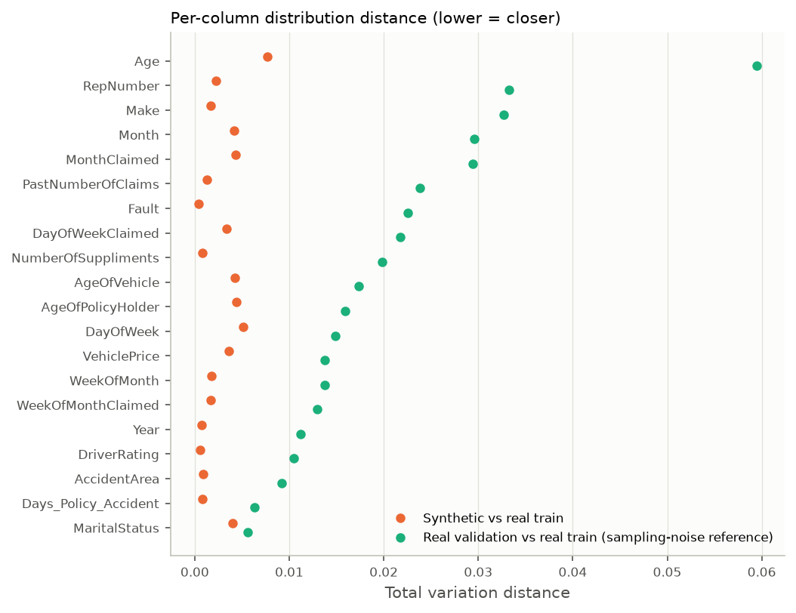

- The per-column total variation distance between synthetic and real train is at most 0.008
  (Age). That is 5–10× smaller than the distance between real validation and real train
  (sampling noise alone, e.g. 0.06 for Age).
- The marginals are reproduced **more closely than an independent sample would be**:
  - Synthetic vs real train: median chi-square p = 0.98, and 75% of columns have p > 0.9.
  - Synthetic vs real validation: median p = 0.47, which is what sampling noise produces.
- So the generator learned the real-train marginals and has **not** seen validation.
  This is consistent with it being fitted on the 70% train split only.
- **Coverage:**
  - Every real category value appears in the synthetic data, and the synthetic data invents
    none.
  - Of 21,187 pairwise value combinations in real train, 18 never appear in synthetic data.
  - 6.6% of synthetic rows contain at least one pairwise combination never seen in real
    train. That is expected: 10.8k real rows cannot cover every plausible combination.

### 2.2 Joint fidelity: fraud signal per category, associations, mutual information

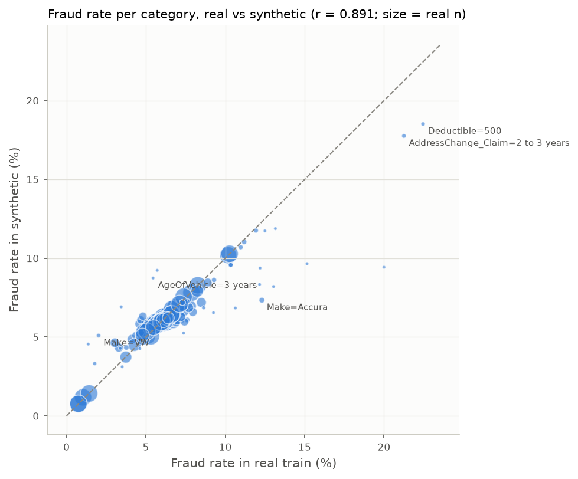

- **Fraud rate per category.** Across the 164 categories with ≥ 30 real rows, real and
  synthetic fraud rates correlate at r = 0.89. No red flag (lift > 1.5) drops below lift 1.2
  in the synthetic data, and no protective signal is lost.
- **The generator flattens weak, small-category signals toward the base rate.** Information
  value, real train vs synthetic:

  | Feature | IV (real) | IV (synthetic) |
  |---|---|---|
  | `Make` | 0.067 | 0.009 |
  | `Month` | 0.064 | 0.023 |
  | `RepNumber` | 0.027 | 0.001 |
  | `Days_Policy_Accident` | 0.018 | 0.003 |

  - Accura's 12.3% fraud rate (n = 325, confirmed at 10.5% on validation) becomes 7.3%.
  - Early-policy incidents fall from 18.9% to 9.5%.
  - The strong signals survive almost exactly: `BasePolicy`, `VehicleCategory`, `Fault`,
    `PolicyType` all have IV within ±0.05.
- **Associations.** The mean absolute difference in pairwise Cramér's V is 0.019. The one
  large gap is `PolicyType × Deductible` (−0.21, weaker in synthetic). Other differences are
  ≤ 0.07.

  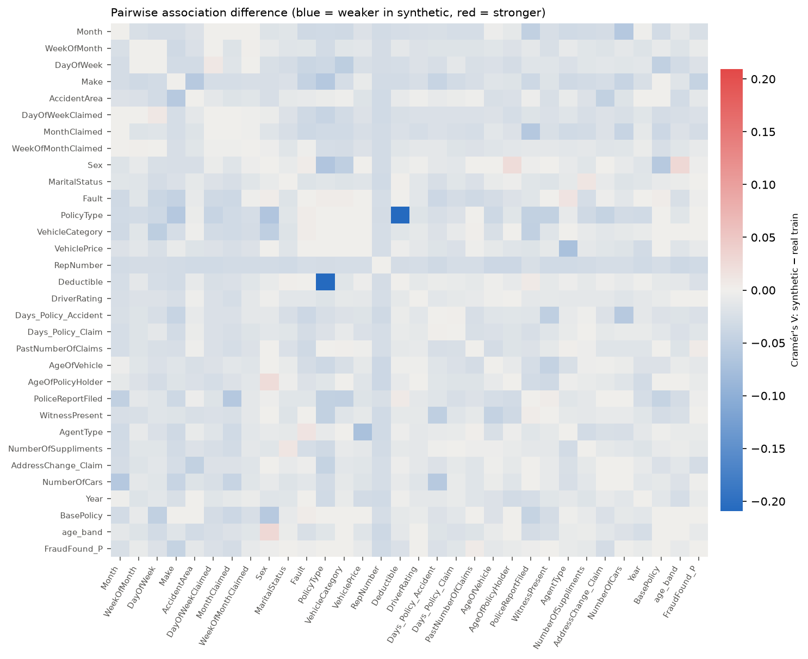

- **Mutual information with the target** (Miller–Madow bias-corrected, so that many-level
  columns do not look informative by chance): the top six features rank identically in both
  origins (PolicyType, BasePolicy, VehicleCategory, Fault, AddressChange_Claim, Deductible).

### 2.3 Adversarial validation

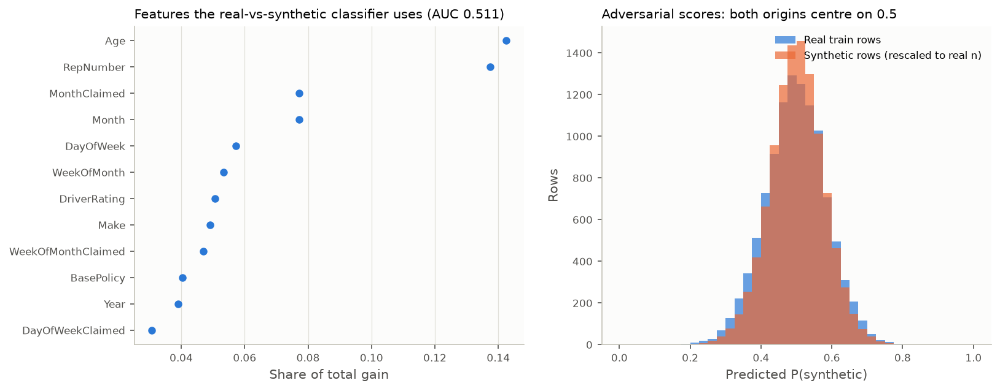

- **Setup:** a LightGBM classifier trained to separate real-train rows from an equal-size
  synthetic sample, using all 32 columns except `PolicyNumber`.
- **Result:** ROC-AUC = 0.511 ± 0.007 (5-fold). Removing the top features (`Age`, then
  `RepNumber`) leaves it at 0.51–0.52.
- No synthetic row scores P(synthetic) > 0.9; the maximum is about 0.75. **The synthetic rows
  are not distinguishable from real ones, and there is no trivially-synthetic subset to filter
  out.**

### 2.4 Utility: TRTR vs TSTR on real validation

The same class-weighted LightGBM is used throughout, with early stopping on 10% of the
*training* data, averaged over 3 seeds. CIs are stratified bootstrap intervals (1,000
resamples). Δ is a paired-bootstrap difference against TRTR. Random-scorer PR-AUC is 0.060.

| Training data | Rows | PR-AUC [95% CI] | ROC-AUC | Δ PR-AUC vs TRTR [95% CI] |
|---|---|---|---|---|
| TRTR: real only | 10,793 | 0.212 [0.171, 0.278] | 0.829 | — |
| TSTR: synthetic, same size as real | 10,793 | 0.183 [0.150, 0.235] | 0.805 | −0.029 [−0.076, +0.008] |
| TSTR: all synthetic | 289,207 | 0.260 [0.213, 0.331] | 0.866 | +0.048 [−0.001, +0.104] |
| Real + all synthetic, w = 1.0 | 300,000 | 0.258 [0.214, 0.327] | 0.866 | +0.047 [+0.001, +0.099] |
| **Real + all synthetic, w = 0.3** | 300,000 | **0.266 [0.218, 0.341]** | **0.868** | **+0.055 [+0.010, +0.107]** |
| Real + all synthetic, w = 0.1 | 300,000 | 0.265 [0.219, 0.341] | 0.865 | +0.053 [+0.009, +0.103] |
| Real + filtered synthetic (V10 violators and unseen-pair rows removed) | 280,803 | 0.256 [0.211, 0.326] | 0.864 | +0.044 [+0.001, +0.094] |
| Logistic regression, real only | 10,793 | 0.133 | 0.788 | −0.079 |
| Logistic regression, real + all synthetic | 300,000 | 0.167 | 0.809 | −0.044 |

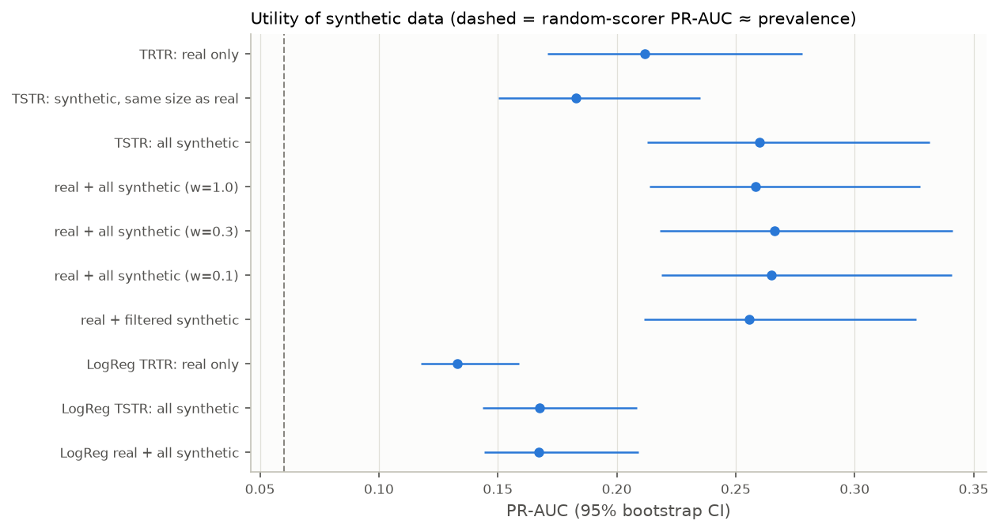

- Row for row, synthetic data is slightly less informative than real data (−0.03, not
  significant). In bulk it **adds about 0.05 PR-AUC**, and the CI excludes 0 for every
  real + synthetic mix.
- The sample weight (0.1, 0.3, 1.0) and filtering change PR-AUC by less than one standard
  error. Step B's data-mix experiment settles the weight.
- The linear model also gains from synthetic data (+0.034) but stays far below the tree
  models: the signal is in interactions (§3.4).

### 2.5 Memorisation and held-out leakage

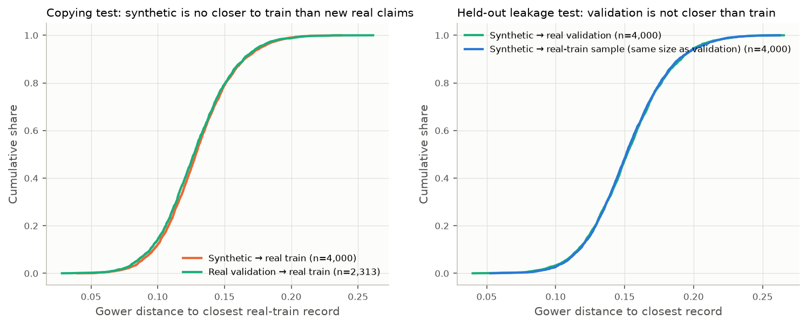

**Distance to closest record** (Gower distance over 32 columns, on 4,000 sampled synthetic
rows):

| Query → reference | 1st pct | 5th pct | Median | Exact copies |
|---|---|---|---|---|
| Synthetic → real train | 0.068 | 0.087 | 0.128 | 0 |
| Real validation → real train | 0.067 | 0.084 | 0.127 | 0 |
| Synthetic → real validation | 0.084 | 0.106 | 0.152 | 0 |
| Synthetic → real-train sample (same size as validation) | 0.087 | 0.107 | 0.151 | 0 |

- Synthetic rows are no closer to real train than new real claims are, so there is no copying.
- Synthetic rows are no closer to validation than to an equal-size train sample, so there is
  no sign the generator saw validation.

**Near-duplicates.** For all 289,207 synthetic rows, we took the maximum number of exactly
matching columns (of 32) against each reference set:

- No synthetic row matches any validation, test or real-train-sample row on ≥ 31 columns.
- The distributions for the three reference sets are nearly identical (30/32 matches: 13 vs
  validation, 16 vs test, 5 vs the train sample).

### 2.6 Verdict

- **Use real + all synthetic rows for training.** The synthetic data is:
  - statistically indistinguishable from real data (adversarial AUC 0.51);
  - not memorised, and shows no evidence of contact with validation or test;
  - useful: +0.05 real-validation PR-AUC.
- **Do not filter.** Filtering removes 7% of rows for no gain, and no artefact subset exists.
- **Let Step B choose the weight** from {0.1, 0.3, 1.0}. 0.3 has the best point estimate.
- **Caveat:** the generator dilutes weak signals (Make, Month, early-policy, small
  categories). The engineered features and red-flag indicators in §5, computed identically on
  real and synthetic rows, give the model those signals explicitly. Model selection and every
  reported metric stay on real data only.

## 3. Fraud EDA

### 3.1 Target

- Fraud prevalence is 5.99% in real train, 5.99% in synthetic and 6.01% in validation.
- Naive baselines:
  - all-legit: accuracy 94.0%, recall 0;
  - random scorer: PR-AUC 0.060.
- Accuracy is therefore not a useful selection metric. PR-AUC is.

### 3.2 Univariate profiles

Fraud rate per category with Wilson CIs and n, for real train and synthetic, by feature group:

| Group | Figure |
|---|---|
| Accident & claim timing | `figures/01_rates_accident_claim_timing.png` |
| Policy | `figures/01_rates_policy.png` |
| Vehicle | `figures/01_rates_vehicle.png` |
| Policyholder | `figures/01_rates_policyholder.png` |
| Claim process | `figures/01_rates_claim_process.png` |

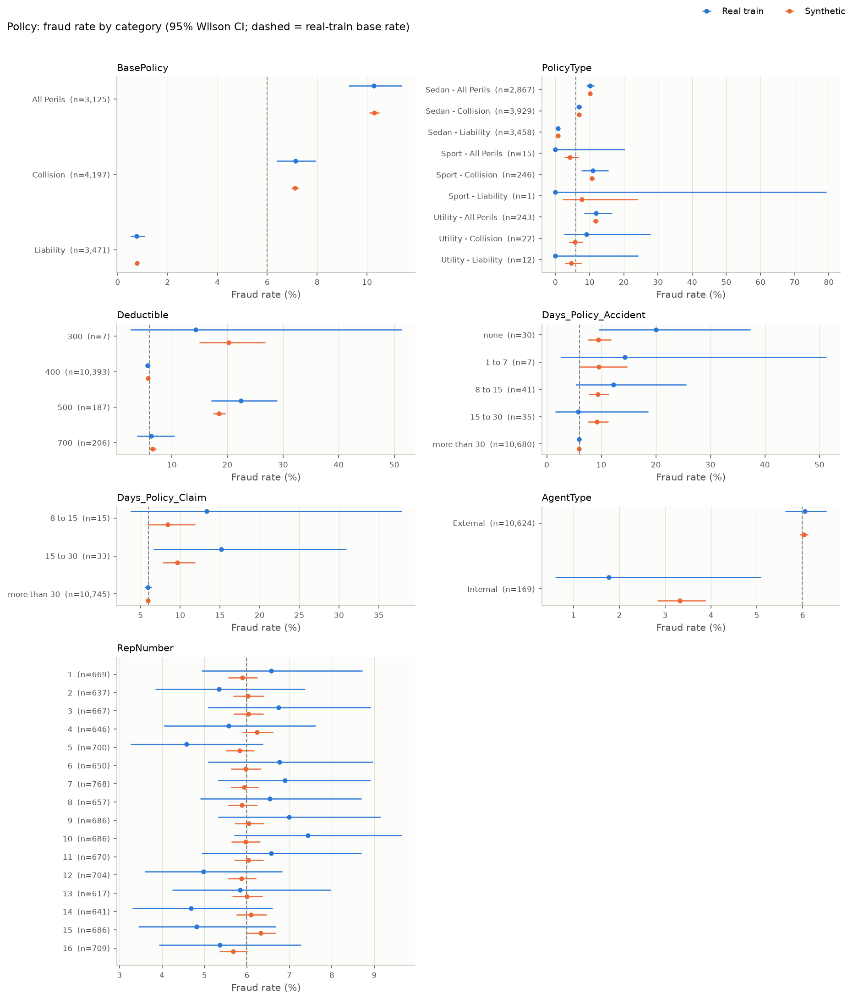

Main signals in real train (base rate 6.0%):

- **Policy and fault:**
  - All Perils 10.3%, Collision 7.1%, Liability 0.75%.
  - Policyholder at fault 7.9% vs third party 1.0%.
- **Vehicle:**
  - Utility 11.2%, Sedan 8.3%, Sport 1.4%.
  - Price extremes: < 20k 8.9%, > 69k 8.2%.
  - Accura 12.3% (n = 325).
- **Deductible:** 500 gives 22.5% (n = 187), but only 7.1% on validation (n = 28). 400 gives
  5.7%.
- **AddressChange_Claim:** "2 to 3 years" gives 21.3% (n = 207). "Under 6 months" is 2/2
  frauds, too rare to use.
- **Past claims (inverse):** none 7.4%, more than 4 3.7%.
- **Agent:** an internal agent gives 1.8% (n = 169).
- **Age:** missing age 10.3%, age 16–20 12.5%, age 51–65 4.8%.
- **Timing** is weak: claim in the same month as the accident 5.6%, 1 month later 6.9%,
  2+ months 7.4%. Fraud declines by year: 1994 6.6%, 1995 6.0%, 1996 5.1% (validation
  follows the same order).
- **No signal** (χ² p > 0.1): `RepNumber` (p = 0.37, and validation rates are uncorrelated),
  `DayOfWeek`, `DayOfWeekClaimed`, `WeekOfMonth*`, `DriverRating`, `NumberOfCars`,
  `WitnessPresent`, `PoliceReportFiled`, `MaritalStatus`.

### 3.3 Association ranking (real train)

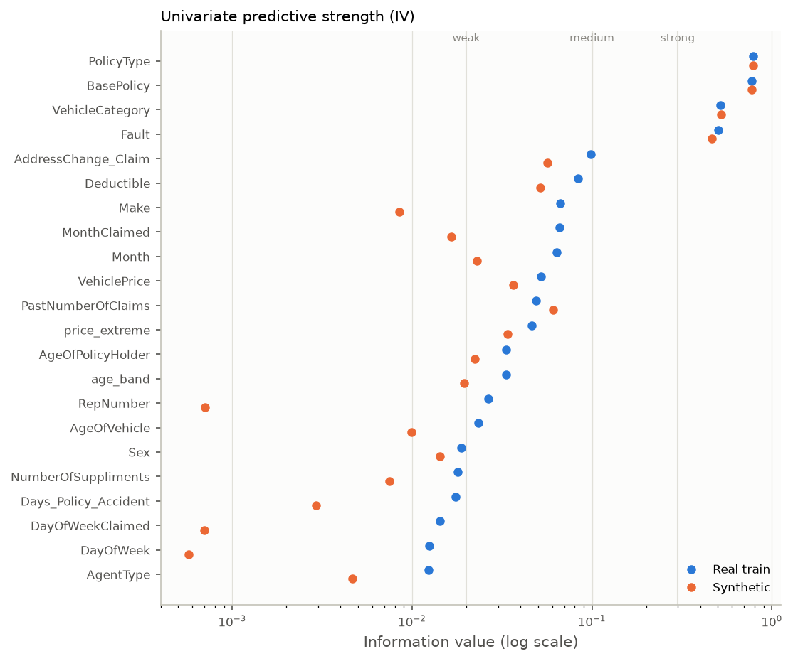

| Feature | χ² p | Cramér's V | IV (real) | IV (synthetic) |
|---|---|---|---|---|
| PolicyType¹ | <1e-50 | 0.164 | 0.785 | 0.786 |
| BasePolicy | <1e-50 | 0.161 | 0.775 | 0.772 |
| VehicleCategory | <1e-40 | 0.141 | 0.516 | 0.520 |
| Fault | <1e-39 | 0.129 | 0.503 | 0.462 |
| AddressChange_Claim | <1e-20 | 0.106 | 0.099 | 0.057 |
| Deductible | <1e-18 | 0.093 | 0.083 | 0.052 |
| Make | 2e-4 | 0.065 | 0.067 | 0.009 |
| MonthClaimed / Month | 1e-4 | 0.059 | 0.066 / 0.064 | 0.017 / 0.023 |
| VehiclePrice | 2e-6 | 0.057 | 0.052 | 0.037 |
| PastNumberOfClaims | 4e-6 | 0.051 | 0.049 | 0.061 |
| age_band | 0.004 | 0.046 | 0.033 | 0.020 |
| RepNumber | 0.37 | 0.039 | 0.027 | 0.001 |

¹ Display-only, because it duplicates VehicleCategory × BasePolicy.

IV labelled "suspicious" (> 0.5) here reflects genuinely strong categorical structure, not
leakage: these columns are known when the claim is filed.

### 3.4 Interactions

The fraud signal is concentrated in interactions, which is why tree models beat the linear
model by about 0.1 PR-AUC (§2.4).

- **Fault × BasePolicy** (`figures/01_interaction_Fault_x_BasePolicy.png`):
  - Policyholder at fault on All Perils: 15.7% (n = 1,944).
  - Policyholder at fault on Collision: 9.8%.
  - Every third-party or Liability cell: ≤ 1.3%.

  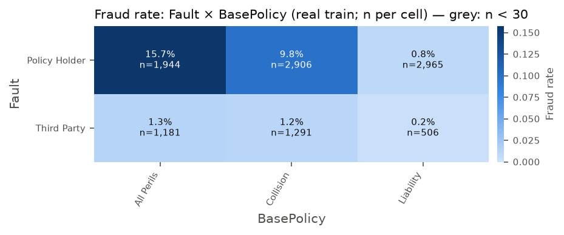

- **Third-party fraud is a single cluster.** Third-party-fault claims are 1.0% fraud overall,
  but all 31 third-party frauds in real train have a 500 deductible and/or an address change
  2–3 years before the claim. The two conditions coincide in 53 of 55 claims.
  - Third party + deductible 500: 54.5% fraud (n = 55).
  - Third party + deductible 400: 0 of 2,867.
  - The pattern holds in synthetic data (44.5%) and on validation (2 of 7).
  - Files: `01_interaction_Fault_x_Deductible.png`, `01_interaction_Fault_x_AddressChange_Claim.png`.
- **VehicleCategory × VehiclePrice:**
  - Sport is low risk at every price except > 69k (4.6%).
  - Sedan is risky at both price extremes (9.6% and 10.6%).
  - Utility > 69k: 11.8%.
- **VehicleCategory × BasePolicy:**
  - Sport on Collision: 11.0% (n = 246).
  - Sport on Liability, the usual case: 0.8%.
- **age_band × Fault:**
  - Age 16–20 at fault: 18.0% (n = 61).
  - Missing age at fault: 12.1%.
  - Third-party claims are ≤ 2% at every age.
- **PastNumberOfClaims × AddressChange_Claim:** no prior claims + address change 2–3 years
  gives 37.3% (n = 59). Cells with n < 30 are greyed out in the figures.
- **Claim lag × PoliceReportFiled:**
  - Police reports are rare (2.7%) and slightly protective (3.8% vs 6.0%).
  - Lag adds little: 2+ months without a report gives 7.6%.
  - This interaction is not worth a feature.

### 3.5 Redundancy

| Pair | Finding | Decision |
|---|---|---|
| AgeOfPolicyHolder vs Age | deterministic (shifted bands) | display only; model uses `age_band` + `age_missing` |
| PolicyType vs VehicleCategory + BasePolicy | deterministic (Cramér's V = 1.0) | display only |
| MonthClaimed vs Month | V = 0.75; claim lag 74% same month, 21% next month | keep `Month`; replace `MonthClaimed` with `claim_lag_months` / `claim_lag_weeks` |
| Days_Policy_Claim vs Days_Policy_Accident | V = 0.49; > 99% "more than 30" | keep both as ordinals plus the `early_policy_incident` flag |
| DayOfWeekClaimed vs DayOfWeek | V = 0.15; no target signal | keep for weekend flags only |

### 3.6 Sensitive attributes

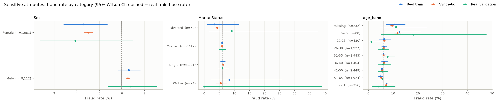

Fraud-rate differences in real train:

- **Sex:** male 6.3% vs female 4.3% (p = 0.001; validation 6.4% vs 3.9%).
- **MaritalStatus:** no difference (p = 0.79).
- **Age:** missing 10.3%, 16–20 12.5%, and 4.8–7.3% across the other bands.

**Ablation.** We scored LightGBM (real + synthetic, w = 0.3) on real validation with each
attribute removed, and compared against the all-features model with a paired bootstrap:

| Removed | PR-AUC | Δ vs all features [95% CI] |
|---|---|---|
| (none) | 0.266 | — |
| Sex | 0.271 | +0.004 [−0.015, +0.024] |
| MaritalStatus | 0.264 | −0.002 [−0.015, +0.009] |
| Sex + MaritalStatus | 0.262 | −0.004 [−0.024, +0.015] |
| Sex + MaritalStatus + Age | 0.274 | +0.008 [−0.019, +0.037] |

**Recommendation:**

- **Exclude `Sex` and `MaritalStatus` from the model.** They add no measurable accuracy, and
  using sex to score fraud risk is hard to justify to an adjuster or a regulator.
- **Drop raw `Age`.** Keep the coarse, business-relevant `age_missing` (missing data is a
  documented risk factor and a REQUEST_MORE_INFO trigger) and `age_band`. Raw age adds
  nothing (Δ +0.008 when removed, not significant).
- All three attributes stay in the data for the Step B fairness audit (recall, FPR and flag
  rate by group).

## 4. Red-flag rules (`config/policy_rules.yaml`, type `red_flag`)

**How they were derived:**

1. Mine all single and pairwise `column = value` conditions in real train with n ≥ 40,
   lift ≥ 1.6, and a Wilson lower bound above the base rate (513 candidates;
   `tables/01_eda_mined_conditions.csv`).
2. Curate them into 12 interpretable, non-overlapping rules.
3. Check each rule on synthetic data and on real validation.

RF06 (third party + address change) was retired because it matched almost the same claims
as RF04.

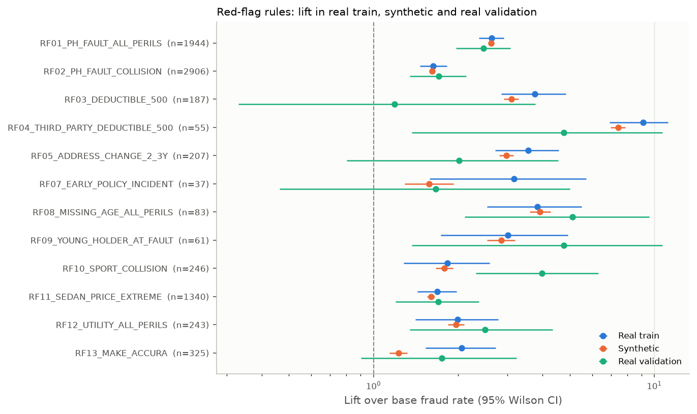

| Rule | Severity | n (real train) | Fraud rate: real train | Lift: real train | Lift: synthetic | Lift: validation (n) |
|---|---|---|---|---|---|---|
| RF01 policyholder at fault, All Perils | warning | 1,944 | 15.7% | 2.6 | 2.6 | 2.5 (445) |
| RF02 policyholder at fault, Collision | info | 2,906 | 9.8% | 1.6 | 1.6 | 1.7 (625) |
| RF03 deductible 500 | info | 187 | 22.5% | 3.8 | 3.1 | 1.2 (28) |
| RF04 third party at fault, deductible 500 | warning | 55 | 54.5% | 9.1 | 7.4 | 4.8 (7) |
| RF05 address change 2–3 years | warning | 207 | 21.3% | 3.6 | 3.0 | 2.0 (33) |
| RF07 early-policy incident (V08) | warning | 37 | 18.9% | 3.2 | 1.6 | 1.7 (20) |
| RF08 missing age, All Perils | warning | 83 | 22.9% | 3.8 | 3.9 | 5.1 (13) |
| RF09 holder aged 16–20 at fault | info | 61 | 18.0% | 3.0 | 2.8 | 4.8 (7) |
| RF10 sport vehicle on Collision | info | 246 | 11.0% | 1.8 | 1.8 | 4.0 (46) |
| RF11 sedan at an extreme price | info | 1,340 | 10.1% | 1.7 | 1.6 | 1.7 (284) |
| RF12 utility vehicle on All Perils | info | 243 | 11.9% | 2.0 | 2.0 | 2.5 (60) |
| RF13 make Accura | info | 325 | 12.3% | 2.1 | 1.2 | 1.8 (76) |

- **Every rule keeps lift > 1 on validation.** RF03 weakens to 1.2 (2 of 28), which is why
  it is `info`.
- **Used together as a rules-only score** (warning = 2, info = 1), the rules reach PR-AUC
  0.142 and ROC-AUC 0.78 on validation, against 0.060 / 0.50 for a random scorer. This is the
  "rules-only" baseline for Step B.
- 21% of validation claims trigger at least one `warning` flag.
- **Red flags never block a claim.** The policy-check tool reports them, and the agent cites
  them in its rationale.

## 5. Feature-engineering plan (for `src/ml/preprocess.py`, Step B)

All features are row-wise functions of the raw claim (`src/validation/feature_engineering.py`),
so they need no fitting and are identical for real and synthetic rows.

| Group | Features | Encoding |
|---|---|---|
| Strong categoricals | Fault, BasePolicy, VehicleCategory, AgentType, AccidentArea, Make (rare makes pooled) | one-hot (linear / MLP), native categorical (CatBoost / LightGBM) |
| Ordered ranges | VehiclePrice, Days_Policy_Accident, Days_Policy_Claim, PastNumberOfClaims, AgeOfVehicle, NumberOfSuppliments, AddressChange_Claim, NumberOfCars, age_band | ordinal in natural order (and one-hot for linear) |
| Numeric | Deductible, DriverRating, Year, WeekOfMonth, claim_lag_weeks, claim_lag_months | scaled for linear / MLP |
| Cyclic | Month, DayOfWeek | sin/cos for linear / MLP; categorical for trees |
| Engineered flags | age_missing, early_policy_incident, price_extreme, policyholder_fault, liability_only, accident_weekend, claim_weekend | binary |
| Red-flag indicators | RF01–RF13 (12 rules) and a weighted red-flag score | binary / count |
| Validation | count of failed consistency rules (V04–V12) | count |

**Excluded from the model:**

- `PolicyNumber` and `is_synthetic` (leakage).
- `PolicyType` and `AgeOfPolicyHolder` (redundant; display-only).
- `RepNumber` (no signal, p = 0.37).
- `Sex` and `MaritalStatus` (fairness; no accuracy gain).
- raw `Age` (replaced by `age_band` + `age_missing`).
- `MonthClaimed`, `DayOfWeekClaimed` and `WeekOfMonthClaimed` (replaced by lag and weekend
  features).
- `PoliceReportFiled` and `WitnessPresent` are kept: rare but plausibly protective.

**Training data:** real train + all synthetic rows, sample weight chosen from {0.1, 0.3, 1.0}
by the Step B data-mix experiment on real validation.
